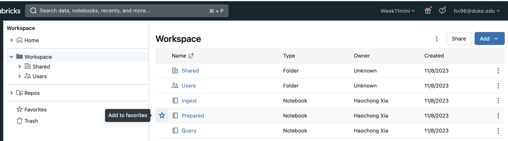
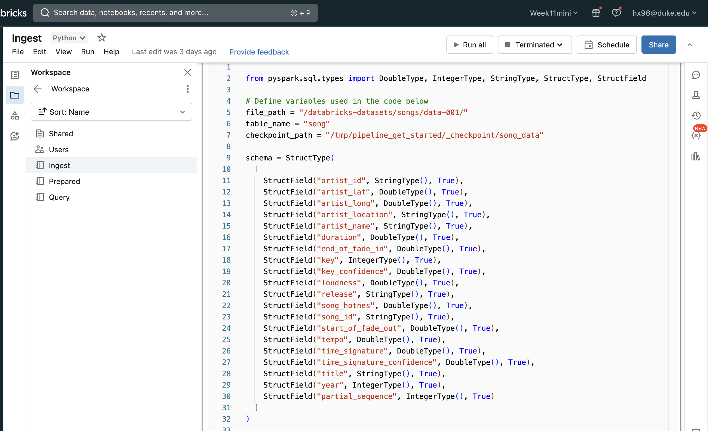
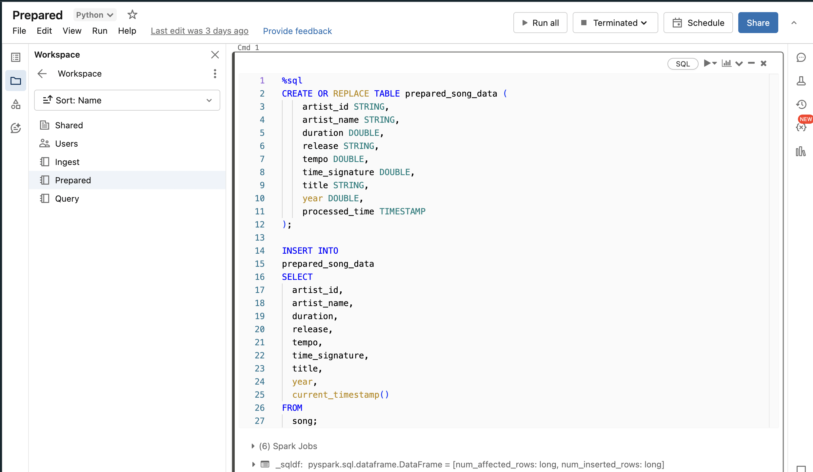
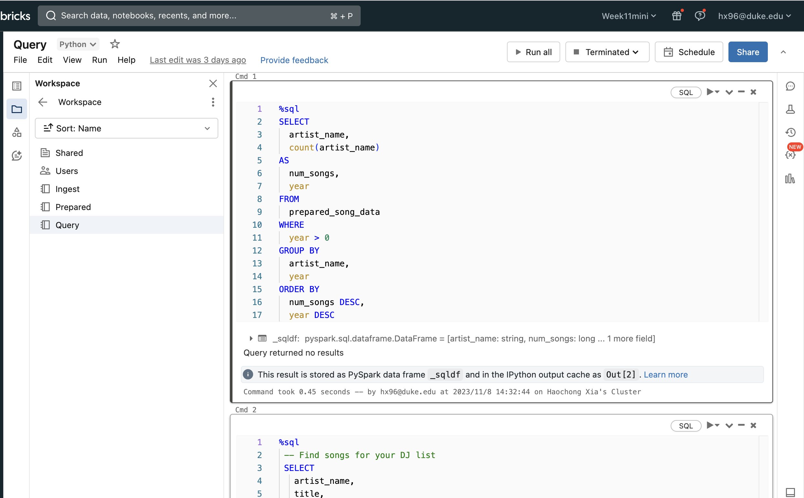
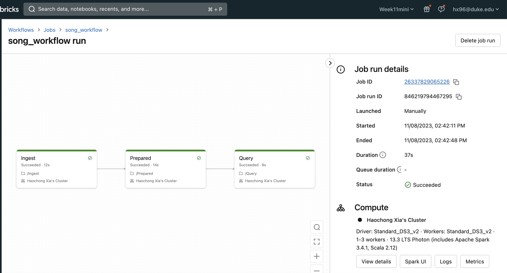

# Haochong-week10-mini-repo 
This is a repo template for course 706_Data_Engineering Week 11 Mini Project. I used databricks to create a data pipeline.

# Purpose
- Create a data pipeline using Databricks
- Include at least one data source and one data sink

## Preparation 
1. Open Databricks and create a new cluster
2. Create new notebooks and attach it to the cluster

## Ingest the raw data

## Preapare the raw data

## Query the data

## workflow successed

## References

https://docs.databricks.com/en/getting-started/data-pipeline-get-started.html

